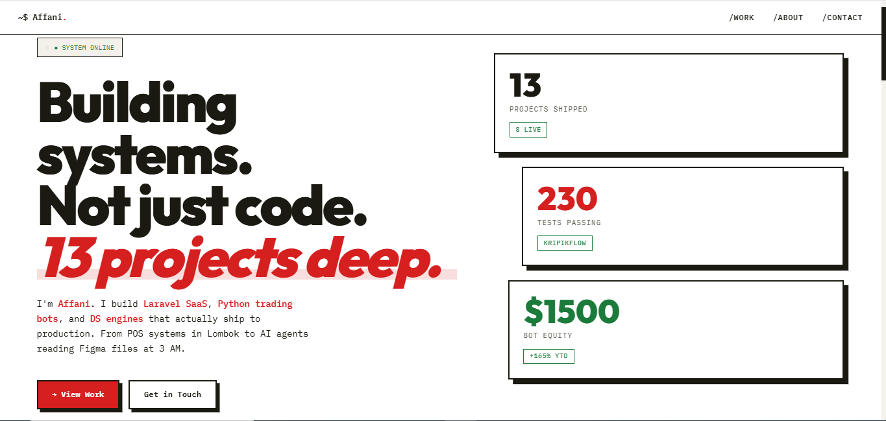

# jones-portfolio

Personal portfolio site. Static HTML + CSS, editorial brutalism style.

## Live Demo

[Live Portfolio Website](https://jones-portfolio-omega.vercel.app/)



## Stack

- **Frontend:** Pure HTML + CSS (no framework)
- **Fonts:** Outfit (display) + IBM Plex Mono (mono)
- **Deploy:** Vercel (static)

## Structure

```
portfolio-site/
├── index.html
├── assets/
│   └── css/style.css
├── vercel.json
└── README.md
```

## Local Preview

```bash
python -m http.server 8000
# open http://localhost:8000
```

## Deploy

Connected to Vercel — auto-deploy on `main` push.

```bash
git push origin main
```

## Design

Editorial Brutalism — light theme. Anti-AI-slop principles:
- Asymmetric layout (cards span 7/5 columns)
- Thick black borders + hard shadows (no blur)
- Bold colors (red, orange, green)
- Rotated stat cards
- Terminal-style accents (mono fonts, prompt markers)


## Visual Style

The portfolio features:
- Heavy use of bold colors (red, orange, green) against white backgrounds
- Thick black borders with hard drop shadows
- Asymmetrical card layouts with rotation
- Terminal-inspired typography and UI elements
- Semantic hierarchy through font sizes and spacing

## Projects Preview

### Featured Projects
- **KripikFlow** — Live UMKM distribution platform with real-time reconciliation
- **Toko Bangunan** — POS + Inventory Management for building materials
- **WA Blast Pro** — WhatsApp marketing automation SaaS with Midtrans integration
- **Forex Trading Bot** — Multi-pair forex trading with advanced algorithms

### Development Projects
- **Customer Analytics Suite** — 5-framework analytics platform in planning
- **Sales Forecasting API** — Time-series forecasting with Prophet + LSTM
- **Sentiment Analysis API** — NLP pipeline for review analysis

## Tech Stack

**Frontend:**
- HTML5 (semantic)
- Tailwind CSS (custom utilities)
- Google Fonts (Outfit, IBM Plex Mono)

**Architecture:**
- Static site generation
- Mobile-first responsive design
- No JavaScript (vanilla HTML/CSS)

**CI/CD:**
- Vercel auto-deployment from main branch
- Static asset optimization
- CDN delivery

## Deployment

The site is automatically deployed to Vercel on each push to the `main` branch.